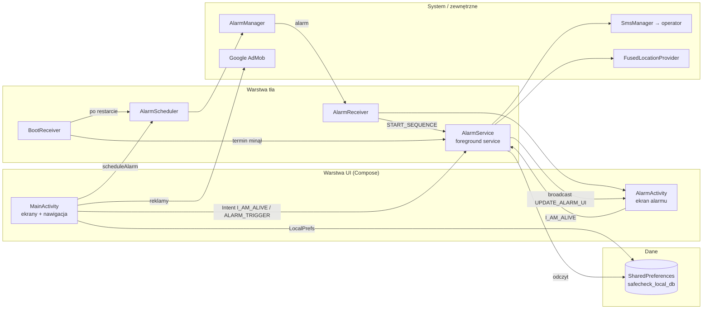
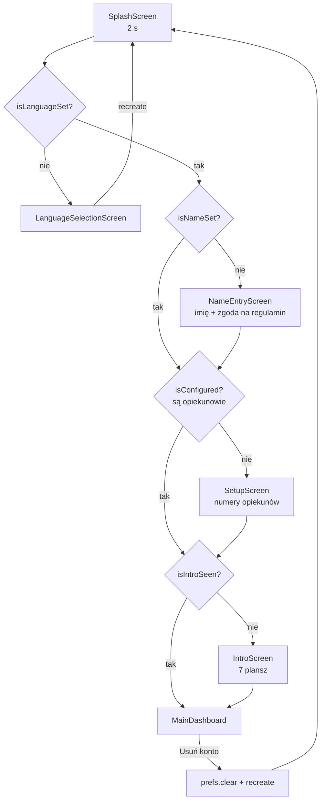
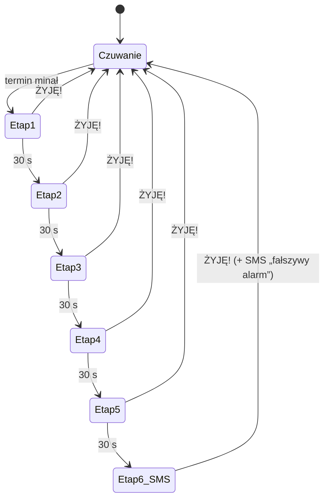
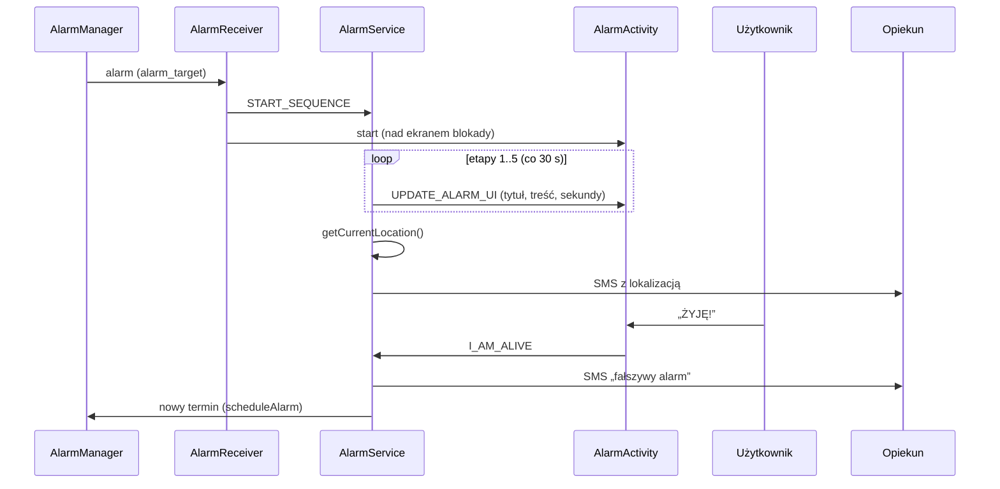

# SafeCheck – dokumentacja techniczna

| | |
|---|---|
| **Produkt** | SafeCheck – aplikacja bezpieczeństwa typu *dead man's switch* dla systemu Android |
| **Wersja kodu** | 2.5.2 (versionCode 18) |
| **Platforma** | Android 7.0+ (minSdk 24), target Android 15 (targetSdk 35) |
| **Język / UI** | Kotlin 1.9.22, Jetpack Compose (Material 3) |
| **Backend** | brak – aplikacja działa w 100% lokalnie na urządzeniu |
| **Monetyzacja** | reklamy Google AdMob (baner + reklama pełnoekranowa) |
| **Języki interfejsu** | angielski (domyślny), polski, niemiecki, francuski |

---

## Spis treści

1. [Opis produktu](#1-opis-produktu)
2. [Stos technologiczny](#2-stos-technologiczny)
3. [Uruchomienie i budowanie](#3-uruchomienie-i-budowanie)
4. [Konfiguracja (dane do podmiany)](#4-konfiguracja-dane-do-podmiany)
5. [Struktura projektu](#5-struktura-projektu)
6. [Architektura](#6-architektura)
7. [Opis komponentów](#7-opis-komponentów)
8. [Sekwencja alarmowa](#8-sekwencja-alarmowa)
9. [Planowanie alarmów](#9-planowanie-alarmów)
10. [Model danych i przechowywanie](#10-model-danych-i-przechowywanie)
11. [Kontrakt komunikacji (Intenty, broadcasty)](#11-kontrakt-komunikacji-intenty-broadcasty)
12. [Powiadomienia](#12-powiadomienia)
13. [Uprawnienia](#13-uprawnienia)
14. [Obsługa numerów telefonów](#14-obsługa-numerów-telefonów)
15. [Reklamy (AdMob)](#15-reklamy-admob)
16. [Internacjonalizacja](#16-internacjonalizacja)
17. [Bezpieczeństwo i prywatność](#17-bezpieczeństwo-i-prywatność)
18. [Testowanie](#18-testowanie)
19. [Wydanie i publikacja w Google Play](#19-wydanie-i-publikacja-w-google-play)
20. [Znane ograniczenia i dług techniczny](#20-znane-ograniczenia-i-dług-techniczny)
21. [Proponowany rozwój (roadmapa)](#21-proponowany-rozwój-roadmapa)
22. [Słownik pojęć](#22-słownik-pojęć)

---

## 1. Opis produktu

SafeCheck jest dla osób mieszkających samotnie: seniorów, osób przewlekle chorych, osób pracujących lub podróżujących w pojedynkę. Gdy użytkownik przez dłuższy czas nie daje znaku życia, aplikacja automatycznie powiadamia jego bliskich.

**Zasada działania:**

1. Użytkownik ustawia długość licznika (domyślnie **48 godzin**) i podaje numery telefonów **opiekunów**.
2. Co jakiś czas naciska duży przycisk **„ŻYJĘ!”**, który zeruje licznik i rozpoczyna odliczanie od nowa.
3. Gdy licznik dojdzie do zera, telefon włącza **głośny alarm**, również na zablokowanym ekranie.
4. Jeśli użytkownik nie zareaguje przez około **2,5 minuty**, aplikacja wysyła do każdego opiekuna **SMS z lokalizacją GPS** (linki do Google Maps i Apple Maps).
5. Jeśli użytkownik potwierdzi później, że wszystko w porządku, opiekunowie dostają SMS „fałszywy alarm”.

**Cechy wyróżniające:**
- Brak konta, rejestracji i serwera. Dane nie opuszczają telefonu, z wyjątkiem SMS-ów wysyłanych do opiekunów.
- SMS-y idą przez sieć komórkową użytkownika, więc nie trzeba internetu ani aplikacji po stronie opiekuna.
- Alarm działa przy zamkniętej aplikacji, w trybie oszczędzania energii i po restarcie telefonu.
- Ostrzeżenia o ustawieniach producentów (Xiaomi, Huawei, Oppo, Vivo), które agresywnie zamykają aplikacje w tle.

---

## 2. Stos technologiczny

| Obszar | Technologia | Wersja |
|---|---|---|
| Język | Kotlin | 1.9.22 |
| Kompilator Compose | `kotlinCompilerExtensionVersion` | 1.5.10 |
| Build | Gradle (wrapper) / Android Gradle Plugin | 8.5 / 8.2.2 |
| JDK do budowania | Java | 17 |
| UI | Jetpack Compose BOM | 2023.08.00 (UI 1.5.0, Material 3 1.1.1) |
| Ikony | `material-icons-extended` | z BOM |
| AndroidX | core-ktx / appcompat / lifecycle-runtime-ktx / activity-compose | 1.15.0 / 1.6.1 / 2.8.7 / 1.10.1 |
| Reklamy | Google Mobile Ads SDK (`play-services-ads`) | 23.0.0 |
| Lokalizacja | `play-services-location` (FusedLocationProvider) | 21.0.1 |
| Numery telefonów | `io.michaelrocks:libphonenumber-android` | 8.13.35 |
| Współbieżność | Kotlin Coroutines (przez Compose / lifecycle) | 1.7.3 |

Aplikacja nie korzysta z bibliotek DI (Hilt/Koin), Navigation, Room ani Retrofit. Jest to świadomie prosta architektura „single-activity + Compose”, opisana w [rozdziale 6](#6-architektura).

---

## 3. Uruchomienie i budowanie

### 3.1 Wymagania
- Android Studio Hedgehog (2023.1) lub nowsze. Zalecane jest najnowsze stabilne wydanie.
- JDK 17 (wbudowany w Android Studio).
- Android SDK Platform 35.

### 3.2 Pierwsze uruchomienie
1. *File → Open* i wskaż katalog `SafeCheck-kotlin`.
2. Poczekaj na *Gradle Sync*.
3. Wybierz konfigurację `app` i urządzenie (fizyczne albo emulator z Google Play Services) → **Run**.

> AdMob i FusedLocationProvider wymagają **Google Play Services**. Na emulatorze wybierz obraz systemu z oznaczeniem *Google APIs* lub *Google Play*.

### 3.3 Linia poleceń

```bash
./gradlew assembleDebug        # APK testowy: app/build/outputs/apk/debug/app-debug.apk
./gradlew installDebug         # instalacja na podłączonym urządzeniu
./gradlew assembleRelease      # APK produkcyjny (wymaga podpisu, patrz rozdz. 19)
./gradlew bundleRelease        # AAB do Google Play
./gradlew lint                 # analiza statyczna
```

### 3.4 Warianty budowania

| Wariant | Minifikacja | Podpis | Zastosowanie |
|---|---|---|---|
| `debug` | nie | klucz debug Android Studio | rozwój i testy |
| `release` | nie (`isMinifyEnabled = false`) | trzeba skonfigurować | publikacja |

---

## 4. Konfiguracja (dane do podmiany)

Wszystkie dane zależne od właściciela aplikacji są w jednym miejscu: **`gradle.properties`**, w sekcji „KONFIGURACJA APLIKACJI”. Plik `app/build.gradle.kts` odczytuje je funkcją `config()`. Brak klucza przerywa budowanie czytelnym komunikatem.

| Klucz | Opis | Trafia do |
|---|---|---|
| `safecheck.applicationId` | identyfikator aplikacji w Google Play. **Po publikacji nie da się go zmienić.** | `defaultConfig.applicationId` |
| `safecheck.admobAppId` | ID aplikacji AdMob, format `ca-app-pub-XXXXXXXX~YYYYYYYY` | `AndroidManifest.xml` przez `manifestPlaceholders["admobAppId"]` |
| `safecheck.admobBannerId` | ID jednostki banera, format `ca-app-pub-XXXX/YYYY` | `BuildConfig.ADMOB_BANNER_ID` |
| `safecheck.admobInterstitialId` | ID jednostki reklamy pełnoekranowej | `BuildConfig.ADMOB_INTERSTITIAL_ID` |
| `safecheck.manualUrl` | link do instrukcji obsługi | `BuildConfig.MANUAL_URL` |
| `safecheck.privacyUrl` | link do polityki prywatności | `BuildConfig.PRIVACY_URL` |
| `safecheck.termsUrl` | link do regulaminu | `BuildConfig.TERMS_URL` |

**Wartości domyślne** w repozytorium:
- Reklamy: **oficjalne testowe ID Google**. Działają od razu, wyświetlają reklamy z napisem „Test Ad” i nie generują przychodu.
- Linki: domena `example.com`. Gotowe dokumenty do opublikowania są w katalogu [`docs/strona/`](strona/), patrz [rozdział 19.5](#195-hosting-dokumentów-instrukcja-regulamin-polityka).

**Pozostałe elementy marki:**

| Element | Lokalizacja |
|---|---|
| Podpis „Powered by …” | string `powered_by` w `res/values*/strings.xml` (4 pliki) |
| Ikona aplikacji | `res/mipmap-*/ic_launcher*.webp`, `res/mipmap-anydpi-v26/*.xml`, `res/drawable/ic_launcher_foreground.xml`, kolor `ic_launcher_background` |
| Logo w aplikacji | `res/drawable/ic_safecheck_symbol.xml` (wektor) |
| Kolory interfejsu | `SafeGreen`, `DangerRed`, `BgColor` na początku `MainActivity.kt` |
| Nazwa aplikacji | string `app_name` |
| Pakiet kodu | `com.example.safecheck`: `namespace` w `app/build.gradle.kts` + katalog źródeł (*Refactor → Rename* w Android Studio) |

---

## 5. Struktura projektu

```
SafeCheck-kotlin/
├── README.md                       – skrócony opis i szybki start
├── CHANGELOG.md                    – historia zmian
├── LICENSE.md                      – licencja (kod poufny, wszelkie prawa zastrzeżone)
├── docs/
│   ├── DOKUMENTACJA_TECHNICZNA.md  – ten dokument
│   └── strona/                     – dokumenty dla użytkowników (do hostowania)
│       ├── docs.html               – przeglądarka plików .md (?file=...)
│       ├── instrukcja.md
│       ├── regulamin.md
│       └── polityka-prywatnosci.md
├── gradle.properties               – KONFIGURACJA APLIKACJI
├── settings.gradle.kts / build.gradle.kts
├── gradle/wrapper/                 – Gradle Wrapper 8.5
└── app/
    ├── build.gradle.kts            – konfiguracja modułu, zależności, BuildConfig
    ├── proguard-rules.pro
    └── src/main/
        ├── AndroidManifest.xml
        ├── java/com/example/safecheck/
        │   ├── MainActivity.kt     – UI (wszystkie ekrany), ustawienia, uprawnienia
        │   ├── AdsConsentManager.kt – zgoda na reklamy (Google UMP, RODO)
        │   ├── AlarmService.kt     – usługa pierwszoplanowa: alarm, dźwięk, GPS, SMS
        │   ├── AlarmScheduler.kt   – planowanie alarmu w AlarmManager
        │   ├── AlarmReceiver.kt    – odbiorca alarmu systemowego
        │   ├── BootReceiver.kt     – przywracanie alarmu po restarcie
        │   └── AlarmActivity.kt    – pełnoekranowy ekran alarmu
        └── res/
            ├── values/ values-pl/ values-de/ values-fr/   – teksty
            ├── drawable/ mipmap-*/                        – grafiki i ikony
            └── xml/                                       – reguły kopii zapasowej
```

### 5.1 Organizacja `MainActivity.kt`

Plik ma około 2600 linii i jest podzielony na ponumerowane sekcje, oznaczone w kodzie komentarzami `// N. NAZWA`:

| Sekcja | Zawartość |
|---|---|
| 1 | stałe (`MANUAL_URL`…), kolory, klasy danych `LanguageOption`, `IntroStep`, `PhoneContact`, `Country` |
| 2 | `ContextUtils` – wymuszenie języka aplikacji |
| 3 | `LocalPrefs` – dostęp do SharedPreferences, `Modifier.safeClick` |
| 4 | `MainActivity` – punkt wejścia, motyw, nawigacja, reklama pełnoekranowa |
| 5 | ekrany konfiguracji: `SplashScreen`, `LanguageSelectionScreen`, `LanguageChangeDialog`, `NameEntryScreen`, `SetupScreen`, `IntroScreen` |
| 6 | `MainDashboard` – ekran główny, menu boczne, baner |
| 7 | okna dialogowe: `AboutAppDialog`, `AccountManagementDialog`, `EditNameDialog`, `InviteFriendsDialog`, `TimeEditDialog`, `SmallTimeInput`, `DrawerMenuItem`, `TimeSegment` |
| 8 | uprawnienia: `Check…UI()`, `PermissionAlertDialog`, `openSettings` |
| 9 | numer telefonu: `getFlagEmoji`, `getAllCountries`, `AdvancedPhoneInput`, `GhostMaskTransformation` |

> Rekomendacja: przy dalszym rozwoju warto rozbić plik na pakiety `ui/screens`, `ui/dialogs`, `permissions`, `data` (patrz [rozdział 21](#21-proponowany-rozwój-roadmapa)).

---

## 6. Architektura

### 6.1 Widok ogólny



### 6.2 Założenia architektoniczne

- **Single Activity + Compose.** Wszystkie ekrany konfiguracji i ekran główny działają w `MainActivity`. Osobną aktywnością jest tylko `AlarmActivity`, bo musi się pokazywać na ekranie blokady.
- **Nawigacja oparta na stanie.** Zamiast biblioteki Navigation blok `when` w `MainActivity.onCreate()` wybiera ekran na podstawie flag (`isLanguageSet`, `isNameSet`, `isConfigured`, `isIntroSeen`).
- **Stan UI** trzymany jest w `remember { mutableStateOf(...) }` wewnątrz composable. Aplikacja nie ma ViewModeli. Trwałe dane trafiają do `LocalPrefs` (SharedPreferences).
- **Źródło prawdy o terminie** to klucz `alarm_target` (timestamp w ms). Czytają go UI (`MainDashboard`), `AlarmService` i `BootReceiver`.
- **Podwójne zabezpieczenie wyzwolenia alarmu:**
  1. alarm systemowy w `AlarmManager`, który działa przy zamkniętej aplikacji,
  2. pętla w `MainDashboard`, która sprawdza czas co 100 ms, gdy ekran jest widoczny.

  Duplikację startu sekwencji blokuje warunek `currentStage == 0` w `AlarmService`.

### 6.3 Przepływ ekranów



Od momentu wyjścia ze `SplashScreen` aktywne są też komponenty `Check…UI()`, które w razie braku uprawnień nakładają okna z prośbą o ich nadanie.

---

## 7. Opis komponentów

### 7.1 `MainActivity` (`MainActivity.kt`, sekcja 4)

| Element | Opis |
|---|---|
| `attachBaseContext()` | odczytuje `language_code` i opakowuje kontekst przez `ContextUtils.updateLocale()`, żeby wymusić język aplikacji |
| `onCreate()` | `enableEdgeToEdge()`, `AdsConsentManager.gatherConsent()` (zgoda → inicjalizacja AdMob → wczytanie reklamy pełnoekranowej), `setContent { MaterialTheme { … } }` |
| `loadInterstitialAd()` | ładuje `InterstitialAd` (ID z `BuildConfig`). Nic nie robi, dopóki `AdsConsentManager.adsReady` jest `false` |
| `showInterstitial()` | pokazuje gotową reklamę i od razu ładuje kolejną. Wywoływana z `MainDashboard` po „ŻYJĘ!” |

Motyw: `MaterialTheme.colorScheme.copy(primary = SafeGreen, background = BgColor)`.

### 7.2 `LocalPrefs`

Cienka warstwa nad `SharedPreferences`. Każda właściwość odpowiada jednemu kluczowi (patrz [rozdział 10](#10-model-danych-i-przechowywanie)). Zapis jest asynchroniczny (`apply()`).

### 7.3 Ekrany konfiguracji

| Composable | Odpowiedzialność |
|---|---|
| `SplashScreen` | logo, wersja (`PackageManager`), podpis `powered_by` |
| `LanguageSelectionScreen` | lista 4 języków. Wybór zapisuje `language_code`, ustawia `is_lang_set_v2` i wywołuje `recreate()` |
| `LanguageChangeDialog` | to samo jako okno (z menu lub ikony globusa) |
| `NameEntryScreen` | imię (pole tekstowe) + checkbox zgody. Linki do regulaminu i polityki prywatności są w `ClickableText` z adnotacjami `TERMS` i `PRIVACY` |
| `SetupScreen` | lista opiekunów (dodawanie, usuwanie), walidacja numeru przez `AdvancedPhoneInput`, limit 100 numerów. Zapis ustawia pierwszy termin i planuje alarm |
| `IntroScreen` | 7 plansz z ikonami, wskaźnik postępu, na końcu linki do dokumentów. „Start!” ustawia `is_intro_seen` i uruchamia `AlarmService` |

### 7.4 `MainDashboard` (sekcja 6)

- **Stan:** `targetTime`, `timeLeftMs`, `duration`, `progress` (0..1) i `isAlarmTriggered`.
- **Pętla licznika:** `LaunchedEffect(targetTime, duration)`.
  - Przy starcie planuje alarm (`AlarmScheduler.scheduleAlarm`).
  - Co 100 ms przelicza pozostały czas.
  - Synchronizuje się z `prefs.alarmTargetTime`, bo termin może zmienić `AlarmService` po akcji z powiadomienia.
  - Po dojściu do zera wysyła `ALARM_TRIGGER` do `AlarmService`.
- **Przycisk „ŻYJĘ!”:**
  - nowy termin = teraz + `timerDuration`,
  - `I_AM_ALIVE` do `AlarmService`,
  - reklama pełnoekranowa.
- **Licznik dd:hh:mm:ss:** kliknięcie otwiera `TimeEditDialog`.
- **Menu boczne (`ModalNavigationDrawer`):**
  - opiekunowie (okno edycji listy),
  - zaproszenia (najpierw prośba o `READ_CONTACTS`),
  - zarządzanie kontem,
  - język,
  - o aplikacji,
  - przycisk „Sprawdź uprawnienia” (`openSettings`),
  - „Usuń konto”: anulowanie alarmów, zatrzymanie usługi, `prefs.clear()`, `recreate()`.
- **Baner AdMob:** `AndroidView { AdView(...) }`, rozmiar `AdSize.BANNER`.

### 7.5 Okna dialogowe (sekcja 7)

| Okno | Funkcja |
|---|---|
| `AboutAppDialog` | wersja + przyciski do instrukcji, regulaminu i polityki |
| `AccountManagementDialog` | podgląd imienia, przejście do `EditNameDialog`, usunięcie danych |
| `EditNameDialog` | edycja imienia (maks. 30 znaków) |
| `InviteFriendsDialog` | odczyt kontaktów (`ContactsContract`, wątek IO, deduplikacja po numerze). Przycisk „Zaproś” wysyła SMS z linkiem do sklepu Google Play (`invite_sms_body` + `packageName`). Gdy bezpośrednia wysyłka się nie uda, otwiera aplikację SMS (`ACTION_VIEW sms:`) |
| `TimeEditDialog` | 4 pola (D/H/M/S). Minimalny licznik to 10 s. Zapis: nowa długość i nowy termin liczony od teraz |

### 7.6 `AlarmService` (`AlarmService.kt`)

Usługa pierwszoplanowa (`foregroundServiceType="specialUse|location"`), uruchamiana jako `START_REDELIVER_INTENT`.

| Metoda | Opis |
|---|---|
| `onStartCommand` | tworzy kanał powiadomień, przechodzi na pierwszy plan, rozdziela akcje (patrz [rozdział 11](#11-kontrakt-komunikacji-intenty-broadcasty)) |
| `startStage(n)` | ustawia etap, gra lub wycisza dźwięk, aktualizuje powiadomienie i UI, uruchamia `CountDownTimer` 30 s do następnego etapu |
| `fetchLocationAndSendSMS(nr)` | `getCurrentLocation(PRIORITY_HIGH_ACCURACY)` → SMS z linkami do map. Bez uprawnienia, bez pozycji lub przy błędzie wysyła wariant bez lokalizacji |
| `sendMultipartSMS` | `SmsManager.divideMessage` + `sendMultipartTextMessage` (obsługa długich wiadomości i znaków spoza GSM-7) |
| `handleIAmAlive` | zatrzymuje timer i dźwięk. Jeśli SMS alarmowy był wysłany, wysyła SMS „fałszywy alarm”. Zeruje etap, ustawia nowy termin i planuje alarm |
| `updateNotificationAndUI` | broadcast `UPDATE_ALARM_UI` + powiadomienie z `fullScreenIntent` i akcją „ŻYJĘ!” |
| `showMonitoringNotification` | ciche, stałe powiadomienie „SafeCheck Aktywny” z akcją „ZRESETUJ ZEGAR” |
| `playSound` / `stopSound` | `MediaPlayer` z dźwiękiem alarmu systemowego (lub dzwonka), `USAGE_ALARM`, w pętli |

### 7.7 `AdsConsentManager`

Obiekt obsługujący zgodę na reklamy przez **Google UMP 2.2.0**:

| Element | Opis |
|---|---|
| `gatherConsent(activity, onAdsAllowed)` | `requestConsentInfoUpdate` → `loadAndShowConsentFormIfRequired`. Gdy `canRequestAds()`, wywołuje jednorazowo `MobileAds.initialize` i `onAdsAllowed`. Przy zgodzie z poprzedniej sesji reklamy startują od razu |
| `adsReady` | `mutableStateOf<Boolean>` obserwowany przez Compose. Baner w `MainDashboard` renderuje się tylko przy `true` |
| `isPrivacyOptionsRequired` | `true` w regionach objętych regulacjami. Wtedy w „O aplikacji” widać przycisk „Ustawienia prywatności reklam” |
| `showPrivacyOptionsForm(activity)` | ponowne otwarcie formularza (zmiana lub cofnięcie zgody) |

W buildach **debug** region jest wymuszany na EOG (`DEBUG_GEOGRAPHY_EEA`), więc formularz pojawia się przy każdej czystej instalacji. Fizyczne urządzenia testowe dodaje się w `safecheck.umpTestDeviceIds`. Wersja release korzysta z rzeczywistej lokalizacji użytkownika.

### 7.8 `AlarmScheduler`

Opis w [rozdziale 9](#9-planowanie-alarmów).

### 7.9 `AlarmReceiver`

Odbiera alarm z `AlarmManager`. Uruchamia `AlarmService` z akcją `START_SEQUENCE` (`startForegroundService` na API 26+) oraz `AlarmActivity` z flagami `NEW_TASK | CLEAR_TOP`.

### 7.10 `BootReceiver`

Nasłuchuje `BOOT_COMPLETED`, `QUICKBOOT_POWERON` i `USER_PRESENT`, ale reaguje tylko na `BOOT_COMPLETED`, bo tak sprawdza akcję w kodzie.
- Termin w przyszłości → ponowne zaplanowanie alarmu.
- Termin minął (telefon był wyłączony) → natychmiastowy `ALARM_TRIGGER`.

### 7.11 `AlarmActivity`

- Pokazuje się nad ekranem blokady i włącza wyświetlacz: `setShowWhenLocked`, `setTurnScreenOn`, `requestDismissKeyguard` na API 27+, flagi okna na starszych.
- Composable `AlarmScreen` rejestruje odbiornik `UPDATE_ALARM_UI` (`RECEIVER_NOT_EXPORTED`) i wyświetla:
  - tytuł i treść etapu,
  - pierścień odliczania 30 s,
  - przycisk „ŻYJĘ!” (260 dp).
- Kolory: czerwone tło podczas alarmu, żółte podczas przerwy.

---

## 8. Sekwencja alarmowa

### 8.1 Etapy

| Etap | Tytuł | Komunikat | Dźwięk | Czas | Następny |
|---|---|---|---|---|---|
| 1 | ALARM | Potwierdź że żyjesz! | ✔ | 30 s | 2 |
| 2 | OCZEKIWANIE | Następny alarm za chwilę... | ✖ | 30 s | 3 |
| 3 | ALARM | Nie potwierdziłeś że żyjesz! | ✔ | 30 s | 4 |
| 4 | OCZEKIWANIE | Ostatnie ostrzeżenie... | ✖ | 30 s | 5 |
| 5 | ALARM | Za chwilę powiadomimy Twoich bliskich | ✔ | 30 s | 6 |
| 6 | ALARM | SMS WYSŁANY! Czekaj na pomoc. | ✔ | do skutku | – |

Etap 6 zaczyna się **150 s** (2,5 min) po wybuchu alarmu. SMS wysyłany jest raz (flaga `smsSent`) do wszystkich opiekunów.

### 8.2 Diagram stanów



### 8.3 Diagram sekwencji (alarm przy zamkniętej aplikacji)



### 8.4 Treść SMS-ów

Szablony są w `AlarmService.kt` (`trimIndent()`), `{imię}` = `user_name`:

- **z lokalizacją:** nagłówek „🚨🚨🚨 SafeCheck ALARM!”, informacja „{imię} NIE POTWIERDZIŁ OBECNOŚCI!”, linki `https://www.google.com/maps?q=lat,lng` i `http://maps.apple.com/?ll=lat,lng`.
- **brak uprawnienia GPS:** dopisek „(BRAK DOSTĘPU DO GPS)”.
- **brak pozycji / błąd lokalizacji:** „Nie udało się ustalić lokalizacji.” / „Błąd ustalania lokalizacji.”
- **fałszywy alarm:** „SafeCheck: Fałszywy alarm. {imię} potwierdził obecność. Wszystko w porządku.”

> Emoji wymuszają kodowanie UCS-2 (70 znaków na segment). Wiadomość z lokalizacją ma kilka segmentów, a każdy segment operator nalicza jak osobny SMS.

---

## 9. Planowanie alarmów

`AlarmScheduler` (obiekt Kotlin) zarządza **jednym** alarmem końca licznika.

| Funkcja | Działanie |
|---|---|
| `scheduleAlarm(ctx, time)` | anuluje stary alarm 1001 i planuje alarm `requestCode = 1` przez `setAlarmClock`. Każde wywołanie nadpisuje poprzedni termin |
| `scheduleStage(ctx, time, stage)` | niskopoziomowe planowanie z `requestCode = stage` (extra `ALARM_STAGE`) |
| `scheduleExactAlarm(ctx, time)` | alias `scheduleAlarm`, zachowany dla wywołań z `AlarmService` i `BootReceiver` |
| `cancelAlarm(ctx)` | anuluje `requestCode` 1..6 oraz 1001 |

**Dlaczego `setAlarmClock`:** system traktuje go jak budzik. Odpala go dokładnie także w trybie Doze, a w pasku statusu pokazuje ikonę zbliżającego się alarmu. Na Android 12+ wymaga `canScheduleExactAlarms() == true`, inaczej planowanie jest pomijane (patrz `CheckExactAlarmPermissionUI`).

**Kiedy alarm jest (prze)planowany:**

| Zdarzenie | Miejsce |
|---|---|
| zapis opiekunów w kreatorze | `SetupScreen` |
| wejście na ekran główny i każda zmiana `targetTime`/`duration` | `MainDashboard` (`LaunchedEffect`) |
| „ŻYJĘ!” (ekran główny, `AlarmActivity`, powiadomienie) | `AlarmService.handleIAmAlive` |
| zmiana długości licznika | `TimeEditDialog` → `MainDashboard` |
| restart telefonu | `BootReceiver` |
| usunięcie konta | `cancelAlarm` |

> **Poprawka w 2.5.2:** w wersji 2.5.1 istniał drugi, równoległy alarm (`requestCode 1001`, `setExactAndAllowWhileIdle`). Nie był aktualizowany przy zmianie długości licznika ani anulowany przy usunięciu konta, przez co mógł wywołać fałszywy alarm, a w konsekwencji niepotrzebny SMS do opiekunów. Szczegóły są w [CHANGELOG](../CHANGELOG.md).

---

## 10. Model danych i przechowywanie

### 10.1 SharedPreferences – plik `safecheck_local_db`

| Klucz | Typ | Domyślnie | Znaczenie | Zapis | Odczyt |
|---|---|---|---|---|---|
| `language_code` | String | `"en"` | kod języka UI | UI | `MainActivity.attachBaseContext` |
| `is_lang_set_v2` | Boolean | `false` | czy wybrano język | UI | UI |
| `user_name` | String | `""` | imię (do SMS) | UI | UI, `AlarmService` (domyślnie „Użytkownik”) |
| `contact_phones` | String (CSV) | `""` | numery E.164 rozdzielone przecinkami | UI | UI, `AlarmService` |
| `timer_duration` | Long (ms) | `172800000` (48 h) | długość licznika | UI | UI, `AlarmService` |
| `alarm_target` | Long (ms epoch) | `0` | moment końca licznika (`0` = nieustawiony) | UI, `AlarmService` | UI, `AlarmService`, `BootReceiver` |
| `is_intro_seen` | Boolean | `false` | czy pokazano intro | UI | UI |

> `AlarmService` i `BootReceiver` czytają klucze **bezpośrednio**, a nie przez `LocalPrefs`. Zmieniając nazwę klucza, zmień ją we wszystkich miejscach (najlepiej wydzielić stałe, patrz roadmapa).

### 10.2 Klasy danych

```kotlin
data class LanguageOption(val code: String, val name: String, val flag: String)
data class IntroStep(val title: String, val description: String, val icon: ImageVector)
data class PhoneContact(val name: String, val phoneNumber: String)
data class Country(val code: String, val name: String, val dialCode: String, val flagEmoji: String)
```

### 10.3 Kopia zapasowa

`android:allowBackup="true"`, reguły w `res/xml/backup_rules.xml` i `data_extraction_rules.xml` (domyślne, puste). Oznacza to, że **Android Auto Backup może skopiować ustawienia na konto Google użytkownika** i przywrócić je po reinstalacji. Opisuje to polityka prywatności. Aby wyłączyć: `allowBackup="false"` lub wykluczenie `sharedpref/safecheck_local_db.xml` w regułach.

---

## 11. Kontrakt komunikacji (Intenty, broadcasty)

### 11.1 Akcje `AlarmService`

| Akcja | Nadawca | Skutek |
|---|---|---|
| `START_SEQUENCE` | `AlarmReceiver` | start etapu 1 (jeśli `currentStage == 0`) |
| `ALARM_TRIGGER` | `MainDashboard`, `BootReceiver` | jak wyżej |
| `I_AM_ALIVE` | `MainDashboard`, `AlarmActivity`, akcje powiadomień | `handleIAmAlive()` |
| `STOP_SERVICE` | (nieużywana w UI) | zatrzymanie usługi |
| brak akcji | `MainActivity`, `IntroScreen` | powiadomienie „SafeCheck Aktywny” |

### 11.2 Broadcast `UPDATE_ALARM_UI`

Wysyłany przez `AlarmService` z `setPackage(packageName)`, odbierany przez `AlarmScreen`.

| Extra | Typ | Opis |
|---|---|---|
| `TITLE` | String | tytuł etapu |
| `MESSAGE` | String | treść etapu |
| `SECONDS` | Int | sekundy do następnego etapu (0 w etapie 6) |
| `IS_ALARM` | Boolean | `true` dla etapów nieparzystych (czerwone tło) |

### 11.3 Komponenty w manifeście

| Komponent | `exported` | Uwagi |
|---|---|---|
| `MainActivity` | true | launcher |
| `AlarmActivity` | false | `showWhenLocked`, `turnScreenOn` |
| `AlarmService` | false | `specialUse\|location`, właściwość `PROPERTY_SPECIAL_USE_FGS_SUBTYPE` |
| `AlarmReceiver` | false | wywoływany tylko przez własny `PendingIntent` |
| `BootReceiver` | true | wymagane dla akcji systemowych |

---

## 12. Powiadomienia

Jeden kanał: `ALARM_CHANNEL_001` („SafeCheck Alarm”, `IMPORTANCE_HIGH`, wibracje, **bez dźwięku kanału**, bo dźwięk gra `MediaPlayer`, widoczny na ekranie blokady). ID powiadomienia: `1`, współdzielone przez wszystkie stany.

| Stan | Tytuł / treść | Priorytet | Akcja | Inne |
|---|---|---|---|---|
| start usługi | „SafeCheck” / „Inicjalizacja...” | HIGH | – | kategoria SERVICE |
| czuwanie | „SafeCheck Aktywny” / „Czuwam w tle i monitoruję Twój czas.” | LOW | „ZRESETUJ ZEGAR” (`I_AM_ALIVE`) | otwiera `MainActivity` |
| alarm | tytuł/treść etapu | MAX | „ŻYJĘ!” (`I_AM_ALIVE`) | `fullScreenIntent` → `AlarmActivity`, `VISIBILITY_PUBLIC`, kategoria ALARM |

Na Android 14+ `startForeground` jest wywoływane z typem `FOREGROUND_SERVICE_TYPE_SPECIAL_USE`.

---

## 13. Uprawnienia

| Uprawnienie | API | Typ | Cel | Gdzie prosimy |
|---|---|---|---|---|
| `INTERNET`, `ACCESS_NETWORK_STATE` | – | normalne | reklamy | – |
| `SEND_SMS` | – | runtime | SMS alarmowy, zaproszenia | `CheckSmsPermissionUI` |
| `ACCESS_FINE_LOCATION`, `ACCESS_COARSE_LOCATION` | – | runtime | lokalizacja w SMS | `CheckLocationPermissionUI` |
| `READ_CONTACTS` | – | runtime | lista do zaproszeń | menu → „Zaproś znajomych” |
| `POST_NOTIFICATIONS` | 33+ | runtime | powiadomienia | `CheckNotificationPermissionUI` |
| `SCHEDULE_EXACT_ALARM` | 31+ | specjalne | dokładny alarm | `CheckExactAlarmPermissionUI` |
| `USE_FULL_SCREEN_INTENT` | 34+ | specjalne | alarm na blokadzie | `CheckFullScreenIntentPermissionUI` |
| `SYSTEM_ALERT_WINDOW` | – | specjalne | start `AlarmActivity` z tła | `CheckOverlayPermissionUI` |
| `REQUEST_IGNORE_BATTERY_OPTIMIZATIONS` | – | specjalne | brak usypiania | `CheckBatteryOptimizationUI` |
| `FOREGROUND_SERVICE`, `…_SPECIAL_USE`, `…_LOCATION` | 28+/34+ | normalne | usługa w tle | – |
| `WAKE_LOCK`, `RECEIVE_BOOT_COMPLETED` | – | normalne | budzenie, restart | – |

**Wzorzec `Check…UI()`:**
1. Stan `hasPermission` odczytywany jest przy starcie i odświeżany przy każdym `Lifecycle.Event.ON_RESUME` (powrót z ustawień).
2. Dla uprawnień runtime okno pokazuje się z opóźnieniem (500 / 800 / 1000 ms), żeby nie nakładały się jednocześnie.
3. `PermissionAlertDialog`:
   - „Zezwól” otwiera systemowe okno lub ekran ustawień,
   - „Ustawienia” wywołuje `openSettings()`, czyli autostart producenta (Xiaomi, Huawei/Honor, Oppo, Vivo), a w razie braku ustawienia ogólne lub szczegóły aplikacji.

---

## 14. Obsługa numerów telefonów

- **Biblioteka:** `libphonenumber-android` (port Google libphonenumber z metadanymi w zasobach).
- **Lista krajów:** `PhoneNumberUtil.supportedRegions`.
  - Nazwy pochodzą z `Locale.getDisplayCountry()` w bieżącym języku.
  - Flagi emoji są wyliczane z kodu ISO (*regional indicator symbols*).
  - Lista jest posortowana alfabetycznie, z Polską na początku.
- **Walidacja:** `LaunchedEffect(phoneNumber, selectedCountry)`:
  1. `parse(numer, region)`,
  2. `isValidNumber`,
  3. `format(E164)`.

  Wynik `(e164, isValid)` trafia do wywołującego.
- **Zapis:** numery opiekunów zapisywane są wyłącznie w formacie **E.164** (np. `+48601234567`).
- **`GhostMaskTransformation`:** wizualna maska w polu.
  - Na podstawie przykładowego numeru komórkowego kraju wyznacza oczekiwaną liczbę cyfr.
  - Formatuje „na żywo” przez `AsYouTypeFormatter`.
  - Cyfry wpisane są czarne, a brakujące szare zera.
  - Własny `OffsetMapping` utrzymuje poprawną pozycję kursora.
- **Ograniczenia pola:** tylko cyfry, maks. 15 znaków. Kierunkowy wybiera się z listy krajów.

---

## 15. Reklamy (AdMob)

| Format | Miejsce | Kod |
|---|---|---|
| Baner 320×50 (`AdSize.BANNER`) | dół ekranu głównego | `MainDashboard` → `AndroidView { AdView }` |
| Pełnoekranowa (interstitial) | po każdym naciśnięciu „ŻYJĘ!” na ekranie głównym | `MainActivity.loadInterstitialAd()` / `showInterstitial()` |

- Inicjalizacja: dopiero po uzyskaniu zgody, w `AdsConsentManager.initializeAdsOnce()` (wywoływane z `MainActivity.onCreate` przez `gatherConsent`).
- **Zgoda RODO/TCF:** Google UMP (`AdsConsentManager.kt`). Formularz pokazuje się użytkownikom z EOG, UK i Szwajcarii. Zmiana decyzji: „O aplikacji” → „Ustawienia prywatności reklam”.
- ID aplikacji (`com.google.android.gms.ads.APPLICATION_ID`) jest w manifeście jako `${admobAppId}`.
- **Reklamy nigdy nie są wyświetlane podczas alarmu** (`AlarmActivity` ich nie zawiera).

**Wymagania przed publikacją:**
1. Konto AdMob, aplikacja i dwie jednostki reklamowe → ID do `gradle.properties`.
2. Plik **`app-ads.txt`** na stronie dewelopera (domena z karty w Google Play).
3. W konsoli AdMob: **Privacy & messaging → European regulations** – utwórz i opublikuj komunikat zgody dla swojej aplikacji (język, logo, link do polityki prywatności). Bez tego formularz UMP się nie pojawi. Na testowym ID Google wyświetla się komunikat „Publisher Test Ads”.

**Całkowite usunięcie reklam:**
1. usuń `AndroidView { AdView … }` z `MainDashboard`,
2. usuń `loadInterstitialAd`, `showInterstitial`, wywołanie `showInterstitial()`, wywołanie `AdsConsentManager.gatherConsent` (oraz plik `AdsConsentManager.kt` i przycisk w `AboutAppDialog`),
3. usuń zależność `play-services-ads` i wpis `APPLICATION_ID` z manifestu,
4. usuń `safecheck.admob*` z `gradle.properties` i odpowiadające im wywołania `config()` oraz zależność `user-messaging-platform`.

---

## 16. Internacjonalizacja

- Zasoby tekstowe: `values/` (angielski, domyślny), `values-pl/`, `values-de/`, `values-fr/`.
- Język wybiera się w aplikacji, niezależnie od systemu. `ContextUtils.updateLocale()` jest stosowane w `attachBaseContext`, a zmiana wymaga `recreate()`.
- Dodanie języka:
  1. utwórz `values-XX/strings.xml`,
  2. dopisz `LanguageOption` w `LanguageSelectionScreen` i `LanguageChangeDialog`.

**Teksty niezlokalizowane** (wpisane po polsku w kodzie; patrz [rozdział 20](#20-znane-ograniczenia-i-dług-techniczny)):
- treści SMS-ów i powiadomień w `AlarmService`,
- tytuły i opisy okien uprawnień,
- część etykiet: „Proszę podaj swoje imię”, „Cześć, …!”, „Dodaj”, „Start”, „System i Bateria”, „Zezwól”, „Ustawienia”, „Brak przeglądarki”, komunikaty błędów numeru,
- teksty ekranu alarmu: „Ładowanie...”, „ŻYJĘ!”.

**Stringi nieużywane** (pozostałość po wcześniejszej wersji z weryfikacją SMS):
`reason_1..4`, `verify`, `enter_code`, `send_sms`, `sms_verification_req`, `reg_user`, `change_btn`, `change_phone_btn`, `confirm_delete_btn`, `delete_why`, `delete_account_title`, `error_same_number`, `current_phone_format`, `copy_toast_msg`, `menu_logout`, `save`.

---

## 17. Bezpieczeństwo i prywatność

| Obszar | Stan |
|---|---|
| Transmisja danych do serwera dewelopera | **brak** (aplikacja nie ma backendu) |
| Dane osobowe na urządzeniu | imię, numery opiekunów, ustawienia, wszystko w SharedPreferences (prywatny katalog aplikacji, bez szyfrowania) |
| Lokalizacja | pobierana jednorazowo **wyłącznie** w etapie 6 alarmu, wysyłana tylko w SMS, nie jest zapisywana |
| Kontakty | odczytywane tylko w oknie „Zaproś znajomych”, nie są zapisywane ani wysyłane |
| Komponenty eksportowane | tylko `MainActivity` (launcher) i `BootReceiver` (akcje systemowe). Usługa i `AlarmReceiver` nie są eksportowane |
| Broadcast UI | ograniczony do własnego pakietu (`setPackage`) i odbierany z `RECEIVER_NOT_EXPORTED` |
| `PendingIntent` | wszystkie z `FLAG_IMMUTABLE` |
| Strony trzecie | Google AdMob (identyfikator reklamowy, dane urządzenia), Google Play Services (lokalizacja), operator komórkowy (SMS) |
| Kopia zapasowa | włączona (Auto Backup), patrz 10.3 |

Szczegóły dla użytkownika są w [polityce prywatności](strona/polityka-prywatnosci.md).

**Google Play – sekcja „Bezpieczeństwo danych” (Data safety), propozycja wypełnienia:**
- Lokalizacja (przybliżona i dokładna): *udostępniana* (w SMS do opiekunów wskazanych przez użytkownika), funkcja aplikacji, nie jest zbierana przez dewelopera.
- Informacje osobiste (imię, numery telefonów): przechowywane wyłącznie na urządzeniu.
- Identyfikatory urządzenia / reklamowe: zbierane przez AdMob (reklamy, analityka, zapobieganie oszustwom).
- Dane nie są szyfrowane podczas przesyłania przez sieć SMS (ograniczenie technologii SMS).
- Użytkownik może usunąć dane: „Usuń konto” w aplikacji albo odinstalowanie.

> Ostateczne odpowiedzi należy zweryfikować z aktualnym formularzem Play Console i dokumentacją SDK AdMob dotyczącą danych.

---

## 18. Testowanie

Projekt nie zawiera testów automatycznych (patrz roadmapa).

### 18.1 Scenariusze testów ręcznych

| # | Scenariusz | Oczekiwany wynik |
|---|---|---|
| T1 | Pierwsze uruchomienie: język → imię → opiekun → intro | ekran główny, powiadomienie „SafeCheck Aktywny” |
| T2 | Licznik 10 s, aplikacja na pierwszym planie | po 10 s alarm, czerwony ekran, dźwięk |
| T3 | Licznik 10 s, aplikacja zamknięta, ekran zablokowany | ekran się włącza, `AlarmActivity` nad blokadą |
| T4 | Brak reakcji w T2/T3 | etapy 1→5, po ~150 s SMS do opiekunów z linkiem do mapy |
| T5 | „ŻYJĘ!” w etapie 6 | SMS „fałszywy alarm”, licznik od nowa |
| T6 | „ŻYJĘ!” w etapie 1–5 | alarm przerwany, brak SMS |
| T7 | Zmiana licznika (np. 1 h → 10 s → 1 h) | w systemie zawsze **jeden** alarm na aktualny termin |
| T8 | „Usuń konto” | brak zaplanowanych alarmów, powrót do wyboru języka |
| T9 | Restart telefonu przed terminem | alarm odpala o właściwym czasie |
| T10 | Restart po terminie (telefon wyłączony) | alarm od razu po starcie |
| T11 | Odmowa każdego uprawnienia | okno z prośbą wraca po powrocie do aplikacji, aplikacja nie ulega awarii |
| T12 | Zaproszenie znajomego | SMS z linkiem do Google Play, komunikat „Wysłano!” |
| T13 | Zmiana języka na każdy z 4 | teksty z `strings.xml` w nowym języku |
| T14 | Numer niepoprawny / zbyt krótki | przycisk „Dodaj” nieaktywny |

### 18.2 Przydatne polecenia ADB

```bash
# zaplanowane alarmy aplikacji
adb shell dumpsys alarm | grep -A3 com.example.safecheck

# podgląd zapisanych ustawień (tylko build debug)
adb shell run-as com.example.safecheck cat shared_prefs/safecheck_local_db.xml

# nadanie uprawnień bez klikania (emulator / testy)
adb shell pm grant com.example.safecheck android.permission.SEND_SMS
adb shell appops set com.example.safecheck SCHEDULE_EXACT_ALARM allow
adb shell dumpsys deviceidle whitelist +com.example.safecheck

# symulacja trybu Doze
adb shell dumpsys deviceidle force-idle
```

> **Uwaga:** przy testach na prawdziwym telefonie SMS-y są wysyłane naprawdę i płatne według taryfy. Jako opiekuna wpisz własny drugi numer. Emulator nie wysyła SMS-ów do sieci.

---

## 19. Wydanie i publikacja w Google Play

### 19.1 Podpis aplikacji

1. Wygeneruj klucz uploadu (przechowuj go **poza repozytorium** i w kopii zapasowej):
   ```bash
   keytool -genkeypair -v -keystore upload-key.jks -alias upload \
           -keyalg RSA -keysize 2048 -validity 10000
   ```
2. Dodaj do `~/.gradle/gradle.properties` (nie do repozytorium):
   ```properties
   SAFECHECK_STORE_FILE=C:/sciezka/upload-key.jks
   SAFECHECK_STORE_PASSWORD=...
   SAFECHECK_KEY_ALIAS=upload
   SAFECHECK_KEY_PASSWORD=...
   ```
3. W `app/build.gradle.kts`:
   ```kotlin
   android {
       signingConfigs {
           create("release") {
               storeFile = file(providers.gradleProperty("SAFECHECK_STORE_FILE").get())
               storePassword = providers.gradleProperty("SAFECHECK_STORE_PASSWORD").get()
               keyAlias = providers.gradleProperty("SAFECHECK_KEY_ALIAS").get()
               keyPassword = providers.gradleProperty("SAFECHECK_KEY_PASSWORD").get()
           }
       }
       buildTypes { release { signingConfig = signingConfigs.getByName("release") } }
   }
   ```
4. W Play Console włącz **Play App Signing** (wymagane dla AAB).

> Aktualizacja istniejącej aplikacji w Google Play wymaga klucza, którym jest podpisana (lub resetu klucza uploadu przez Play Console, gdy aktywne jest Play App Signing). Nowy `applicationId` oznacza nową kartę w sklepie.

### 19.2 Wersjonowanie

Przy każdym wydaniu zwiększ `versionCode` (liczba całkowita, zawsze rosnąca) i `versionName` w `app/build.gradle.kts`, a zmiany dopisz do `CHANGELOG.md`.

### 19.3 Deklaracje w Play Console

| Element | Wymaganie |
|---|---|
| **SMS (`SEND_SMS`)** | uprawnienie z grupy objętej polityką *SMS and Call Log*. Wymaga formularza *Permissions Declaration* z uzasadnieniem (funkcja bezpieczeństwa: automatyczne powiadomienie wskazanych kontaktów). Akceptacja zależy od aktualnej polityki Google |
| **Usługa pierwszoplanowa `specialUse`** | deklaracja typu FGS z opisem i ewentualnie nagraniem wideo działania |
| **`USE_FULL_SCREEN_INTENT`** | na Android 14+ przyznawane automatycznie tylko aplikacjom typu budzik/połączenia, wymagana deklaracja |
| **`SCHEDULE_EXACT_ALARM`** | uzasadnienie (funkcja alarmu/budzika) |
| **Lokalizacja** | deklaracja w *Data safety*. Aplikacja **nie** prosi o `ACCESS_BACKGROUND_LOCATION` |
| **Reklamy** | zaznacz „Aplikacja zawiera reklamy” |
| **Polityka prywatności** | publiczny URL (`safecheck.privacyUrl`) |
| **Kategoria wiekowa** | formularz IARC. Regulamin przewiduje użytkowników od 16 lat |

### 19.4 Lista kontrolna wydania

- [ ] własne wartości w `gradle.properties` (applicationId, AdMob, linki)
- [ ] własny `powered_by`, ikona i logo
- [ ] uzupełnione dane administratora w regulaminie i polityce prywatności (pola `[…]`)
- [ ] opublikowane dokumenty z `docs/strona/` pod adresami z konfiguracji
- [ ] `app-ads.txt` na stronie dewelopera
- [ ] opublikowany komunikat zgody w AdMob → *Privacy & messaging* (formularz UMP jest już w kodzie)
- [ ] podpis release, Play App Signing
- [ ] `versionCode` / `versionName` + `CHANGELOG.md`
- [ ] testy T1–T14 na co najmniej 2 urządzeniach (w tym Samsung/Xiaomi) z Androidem 14+
- [ ] deklaracje uprawnień i *Data safety* w Play Console

### 19.5 Hosting dokumentów (instrukcja, regulamin, polityka)

Katalog `docs/strona/` jest gotowy do wrzucenia na dowolny hosting statyczny (np. GitHub Pages, Netlify, serwer WWW):

```
https://twoja-domena.pl/safecheck/docs.html?file=instrukcja.md
https://twoja-domena.pl/safecheck/docs.html?file=regulamin.md
https://twoja-domena.pl/safecheck/docs.html?file=polityka-prywatnosci.md
```

- `docs.html` wczytuje wskazany plik `.md` i wyświetla go jako sformatowaną stronę. Dopuszcza tylko pliki z białej listy w kodzie.
- Te trzy adresy wpisz do `gradle.properties` (`safecheck.manualUrl`, `safecheck.termsUrl`, `safecheck.privacyUrl`).
- Pliki `.md` można też podlinkować bezpośrednio lub przekonwertować do HTML.

---

## 20. Znane ograniczenia i dług techniczny

### 20.1 Ryzyka do weryfikacji przed publikacją

| ID | Ryzyko | Szczegóły | Rekomendacja |
|---|---|---|---|
| **R2** | **Lokalizacja w tle** | usługa przechodzi na pierwszy plan z typem `SPECIAL_USE` (bez `LOCATION`), a aplikacja nie ma `ACCESS_BACKGROUND_LOCATION`. Na Android 10+ / 14+ pobranie pozycji przy zamkniętej aplikacji może się nie udać. SMS zostanie wtedy wysłany w wersji „Błąd ustalania lokalizacji” | przetestować T4 przy zamkniętej aplikacji na Android 14/15. Ewentualnie przekazywać typ `SPECIAL_USE or LOCATION` w `startForeground` (z zachowaniem zasad uruchamiania FGS lokalizacji z tła) lub dodać uprawnienie lokalizacji w tle z odpowiednią deklaracją w Play |
| **R3** | **Polityka Google Play dla SMS** | `SEND_SMS` jest uprawnieniem ograniczonym. Odrzucenie deklaracji blokuje publikację | przygotować uzasadnienie i wideo. Alternatywa: wysyłka przez Intent `ACTION_SENDTO`, która wymaga jednak interakcji użytkownika, więc nie działa automatycznie |
| **R4** | **Usypianie przez producentów** | MIUI, EMUI, ColorOS i One UI mogą mimo uprawnień zatrzymywać usługę | `openSettings()` kieruje do autostartu. Instrukcja zawiera wskazówki, warto testować na urządzeniach docelowych |

### 20.2 Dług techniczny

| ID | Opis | Wpływ | Propozycja |
|---|---|---|---|
| D1 | teksty po polsku wpisane na sztywno (SMS, powiadomienia, okna uprawnień, część etykiet) | użytkownicy EN/DE/FR widzą częściowo polski interfejs i dostają polskie SMS-y | przenieść do `strings.xml` |
| D2 | teksty SMS w formie męskiej („potwierdził”, „z nim”) | brak neutralności | formy neutralne lub wybór płci w profilu |
| D3 | `MainActivity.kt` ma ~2600 linii | trudniejsze utrzymanie | podział na pliki/pakiety, ViewModel + `StateFlow` |
| D4 | klucze SharedPreferences zduplikowane w 3 miejscach | ryzyko rozjazdu | wspólne stałe w `LocalPrefs.Companion` |
| D5 | nieużywane: parametr `onReset`, `BenefitItem`, akcja `STOP_SERVICE`, extra `ALARM_STAGE`, kilkanaście stringów (rozdz. 16) | szum w kodzie | usunąć |
| D6 | przestarzałe API: `SmsManager.getDefault()`, `Divider`, `ClickableText`, `CircularProgressIndicator(progress: Float)`, `Locale(String)` | ostrzeżenia przy aktualizacji bibliotek | migracja przy podbiciu Compose BOM |
| D7 | AGP 8.2.2 przy `compileSdk 35` (ostrzeżenie Gradle), Compose BOM z 2023 r. | brak najnowszych poprawek | aktualizacja do aktualnego AGP / Kotlin 2.x (kompilator Compose jako plugin) |
| D8 | brak testów jednostkowych i UI, brak CI | ręczna weryfikacja regresji | testy dla `AlarmScheduler`, `GhostMaskTransformation`, logiki etapów, GitHub Actions |
| D9 | minifikacja wyłączona | większy APK (~15 MB), kod łatwy do odczytania | `isMinifyEnabled = true`, `isShrinkResources = true` + testy release |
| D10 | ustawienia niezaszyfrowane, Auto Backup włączony | numery opiekunów w kopii Google | `EncryptedSharedPreferences` / wykluczenie z backupu (decyzja produktowa) |
| D11 | przy pierwszym uruchomieniu kilka okien uprawnień może pojawić się jedno po drugim nad ekranem wyboru języka | słabszy UX | kolejkowanie uprawnień lub osobny ekran „Uprawnienia” w kreatorze |
| D12 | `BootReceiver` ma w manifeście `QUICKBOOT_POWERON` i `USER_PRESENT`, ale kod reaguje tylko na `BOOT_COMPLETED` | brak przywracania na części urządzeń HTC/Xiaomi (quickboot) | rozszerzyć warunek o `QUICKBOOT_POWERON` |

### 20.3 Błędy i braki naprawione w 2.5.2

| ID | Opis | Poprawka |
|---|---|---|
| B1 | drugi, nieaktualizowany alarm (`requestCode 1001`) mógł wywołać fałszywy alarm po zmianie długości licznika oraz dzwonić po „Usuń konto” | jeden alarm (`requestCode 1`) w `AlarmScheduler`, stary 1001 zawsze anulowany. Zweryfikowano na emulatorze Pixel 8 (`dumpsys alarm`) |
| B2 | okno wyboru kraju miało tytuł „Wybierz Język” | nowy string `select_country` w 4 językach |
| B3 | brak formularza zgody na reklamy (RODO/TCF) wymaganego przez Google w EOG/UK/CH | `AdsConsentManager` (Google UMP 2.2.0). Reklamy ładują się dopiero po zgodzie, a w „O aplikacji” jest przycisk zmiany decyzji. Zweryfikowano na emulatorze Pixel 8 (formularz → zgoda → baner → ponowne otwarcie formularza) |
| B4 | brak spacji w tekście zgody („AkceptujęRegulaminiPolitykę”) | stringi `accept` i `and` w cudzysłowie ze spacjami (4 języki) |
| B5 | ucięty tytuł w górnym pasku ekranu głównego | usunięta sztywna wysokość 75 dp paska |
| B6 | zawartość karty licznika przesunięta w lewo | kolumna z `fillMaxWidth()` |

---

## 21. Proponowany rozwój (roadmapa)

**Krótkoterminowo (przed publikacją / v2.6)**
1. Weryfikacja lokalizacji w tle (R2).
2. Lokalizacja wszystkich tekstów (D1, D2).
3. Porządki: D5, D12, minifikacja (D9).

**Średnioterminowo (v3.0)**
4. Refaktoryzacja do MVVM: `ViewModel` + `StateFlow`, `DataStore` zamiast SharedPreferences, podział `MainActivity.kt` (D3, D4).
5. Testy jednostkowe i instrumentacyjne + CI (D8).
6. Aktualizacja toolchainu (D7) i migracja przestarzałych API (D6).

**Pomysły produktowe**
- harmonogram („przypominaj codziennie o 9:00”) zamiast samego licznika,
- wykrywanie upadku / braku ruchu (akcelerometr),
- przycisk SOS wysyłający SMS od razu,
- konfigurowalna długość etapów i liczba ostrzeżeń,
- wiadomość SMS edytowalna przez użytkownika,
- powiadomienia przez komunikatory / e-mail (wymagałoby backendu),
- widżet na ekran główny i kafelek szybkich ustawień z „ŻYJĘ!”,
- wersja Premium bez reklam (Google Play Billing).

---

## 22. Słownik pojęć

| Pojęcie | Znaczenie |
|---|---|
| **Licznik** | czas, po którym bez potwierdzenia wybucha alarm (`timer_duration`) |
| **Termin** | moment końca licznika (`alarm_target`) |
| **Opiekun** | osoba, której numer użytkownik wpisał. Dostaje SMS przy braku reakcji |
| **„ŻYJĘ!”** | potwierdzenie obecności, które resetuje licznik i przerywa alarm |
| **Sekwencja alarmowa** | 6 etapów po 30 s zakończonych SMS-em |
| **Fałszywy alarm** | potwierdzenie „ŻYJĘ!” po wysłaniu SMS-a alarmowego. Opiekunowie dostają SMS uspokajający |
| **E.164** | międzynarodowy format numeru: `+` i kod kraju, bez spacji |
| **FGS** | *Foreground Service*, usługa z widocznym powiadomieniem, której system nie zamyka |
| **Doze** | tryb oszczędzania energii Androida, ograniczający pracę w tle |
| **Full-screen intent** | powiadomienie, które od razu otwiera pełnoekranową aktywność (jak połączenie przychodzące) |
| **UMP / CMP** | platforma zarządzania zgodami na reklamy wymagana w UE |
